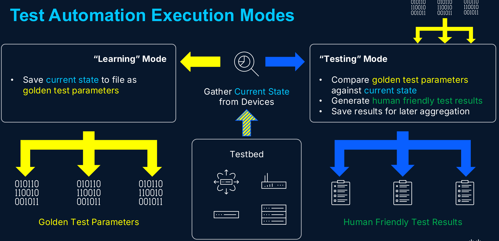

# Execution Modes

Huginn has two execution modes: **learning** and **testing**. Learning mode observes infrastructure and records what it sees. Testing mode re-observes and compares against the recording. Any deviation is drift.



## Why two modes?

A test plan with thousands of test cases needs thousands of expected values. Populating those by hand is slow, error-prone, and brittle - any planned change invalidates large swaths of them. Dual-mode execution removes the manual step entirely: the framework captures expected values from the live network, then uses them for comparison on subsequent runs.

## Learning mode

Learning mode captures the current state of infrastructure as the "known good" baseline.

```bash
huginn run -m learning -t testbed.yaml -p test_plan.yaml
```

During a learning run, each test case:

1. Connects to its target devices (via the framework-managed connection broker)
2. Executes commands and gathers structured state
3. Saves the gathered state to a parameters file

No comparison-based pass/fail judgement occurs (though a test case will still fail if it cannot successfully gather parameters). The output is a set of parameter files representing what the infrastructure looks like *right now*.

### When to run in learning mode

- **Initial deployment** - capture the baseline after confirming the network is healthy
- **After a planned change** - re-learn parameters that were intentionally altered
- **After reconciliation** - when new test case variants are created for changed infrastructure

## Testing mode

Testing mode evaluates infrastructure against expectations derived from previously-learned parameters.

```bash
huginn run -m testing -t testbed.yaml -p test_plan.yaml
```

During a testing run, each test case:

1. Connects to its target devices
2. Executes commands and gathers current state
3. Loads previously-saved parameters as a reference point
4. Evaluates current state against the reference (the evaluation logic depends on the job's archetype - exact match, operator-based comparison, or pass/fail criteria defined by the job itself)
5. Records granular results

### When to run in testing mode

- **Drift detection** - periodic validation that infrastructure hasn't changed unexpectedly
- **Change validation** - run before and after a change to confirm only intended state changed
- **Regression testing** - verify a software upgrade or migration hasn't introduced regressions

## How it works in code

Inherit from `LearningTestCase` and implement two methods - `gather_state` and `compare_state`:

```python
from huginn import Context, LearningTestCase, ResultStatus


class VerifyOSPFCost(LearningTestCase):
    """Learn and verify OSPF interface costs."""

    command = "show ip ospf interface brief"

    async def gather_state(self, context: Context) -> dict[str, object]:
        """Gather current state from all target devices.

        Called in both modes. Returns structured data representing
        the current infrastructure state.
        """
        devices: dict[str, dict[str, object]] = {}
        for device in context.targets:
            result = await context.broker.execute(device, self.command)
            parsed = mn.parse(os=device.os, command=self.command, output=result.output)
            devices[device.name] = {"interfaces": parsed["interfaces"]}
        return {"devices": devices}

    async def compare_state(self, *, expected, current, context: Context) -> None:
        """Compare expected state against current state.

        Called only in testing mode. Records pass/fail results
        for each comparison point.
        """
        for device in context.targets:
            exp = expected["devices"][device.name]["interfaces"]
            cur = current["devices"][device.name]["interfaces"]
            for intf, exp_cost in exp.items():
                cur_cost = cur.get(intf)
                if cur_cost == exp_cost:
                    context.results.add_result(
                        ResultStatus.PASSED,
                        f"{device.name} {intf}: cost {cur_cost}",
                    )
                else:
                    context.results.add_result(
                        ResultStatus.FAILED,
                        f"{device.name} {intf}: cost is {cur_cost}, expected {exp_cost}",
                    )
```

The framework calls `gather_state` in both modes. In learning mode, it saves the return value. In testing mode, it loads the saved parameters and passes both to `compare_state`.

## Parameter storage

Learned parameters are persisted as JSON files in the results directory. Each test case gets its own parameter file, named by its test case identifier:

```
results/
  2026-06-05-09-15-00-learning/
    parameters/
      OSPF-NEIGHBOR-STATE.json
      BGP-SUMMARY-NEIGHBOR-STATE.json
      ...
```

When testing mode runs, it loads parameters from the most recent learning run (or a specific run, if configured).

## Relationship to scenarios

In a change-validation test plan with multiple scenarios, learning and testing modes operate within the context of phases:

```yaml
scenarios:
  link-shutdown-r1r2:
    phases:
      pre-change:
        mode: learning
        test_case_groups: [baseline]
      shutdown:
        test_case_groups: [shut-link]
      post-shutdown:
        mode: testing
        test_case_groups: [baseline]
      normalize:
        test_case_groups: [normalize-link]
      post-normalize:
        mode: testing
        test_case_groups: [baseline]
```

The same test cases run in `pre-change` (learning) and `post-shutdown` (testing). The pre-change phase captures expected state; the post-shutdown phase detects what changed. Only intentional deviations should appear - any unexpected drift is a failure.

## See also

- [Job Archetypes](archetypes.md) - the four shapes a job can take, all built on this dual-mode foundation.
- [Context API - Learning and Testing Modes](../reference/context-api.md#learning-and-testing-modes) - the API surface for mode-aware test logic.
- [Reference - Test Plan Schema](../reference/test-plan.md) - how phases and scenarios reference execution modes.
